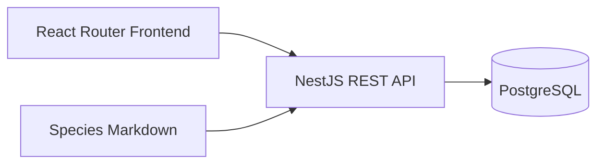

# Architecture

## Overview

Plantly is a web application consisting of:

* a React Router frontend
* a NestJS backend
* a PostgreSQL database
* TypeORM for persistence
* a single Docker Compose deployment

The architecture should remain simple and easy to run locally and deploy. Additional infrastructure should only be introduced when required by a concrete use case.

## Frontend

### Technology

* React
* React Router
* TypeScript
* Tailwind CSS

### Responsibilities

The frontend is responsible for:

* displaying the plant collection
* displaying species information
* supporting fast care-event logging
* displaying plant history
* displaying seasonal care guidance
* communicating with the backend API

Business rules and persistence logic must not depend on frontend behaviour.

### Styling

Tailwind CSS is the default styling approach for the frontend.

Prefer Tailwind utilities and shared reusable components over introducing
additional styling frameworks or ad-hoc styling systems.
UI Design is defined under ui-design.md.

## Backend

### Technology

* Node.js
* NestJS
* TypeScript
* REST API

### Responsibilities

The backend is responsible for:

* enforcing business rules
* validating incoming data
* managing plants, species, locations, and care events
* determining applicable seasonal information
* persisting application data
* exposing the application API
* supporting species import workflows

The backend is the authoritative application layer for domain behaviour.

## Persistence

### Technology

* PostgreSQL
* TypeORM

TypeORM is used for:

* entity mapping
* database access
* relationships
* migrations

### Data Principles

* All schema changes must be handled through TypeORM migrations.
* Care-event history should be preserved.
* Structured domain data should use explicit database fields where practical.
* Flexible metadata may be used for optional event-specific information where appropriate.
* The database should support future analytical queries without requiring analytics features in the application itself.
* Application behaviour must not depend on directly manipulating the database outside the backend.

## Species Knowledge

Species knowledge is maintained as Markdown files.

Markdown provides a human- and agent-friendly format for creating and maintaining species information.

Species definitions must be validated before being imported into PostgreSQL.

The PostgreSQL database is the runtime source used by the application.

Species import must use the application's validation and business rules and must not bypass the backend through direct database manipulation.

Synchronization is initiated through the backend REST API using `POST /admin/species/sync`. The backend reads the authoritative Markdown definitions, validates the complete synchronization, and applies the resulting species changes atomically.

## Deployment

The entire application is deployed using a single Docker Compose configuration.

The deployment contains:

```text
Plantly
├── frontend
│   └── React Router
├── backend
│   └── NestJS
└── database
    └── PostgreSQL
```

Docker Compose is responsible for starting and connecting all required application services.

The same Compose-based setup should be usable for local development and deployment where practical.

Configuration that differs between environments must be supplied through environment variables or environment-specific configuration.

Secrets must not be committed to the repository.

## Communication

The frontend communicates with the backend through the backend's REST API.



The frontend must not communicate directly with PostgreSQL.

Species import processes must go through the application boundary rather than modifying PostgreSQL directly.

## Architectural Principles

* Prefer a modular monolith over distributed services.
* Introduce additional infrastructure only for a concrete requirement.
* Keep domain behaviour independent of the frontend.
* Keep persistence concerns separate from business rules where practical.
* Validate external data at application boundaries.
* Use TypeORM migrations for schema evolution.
* Do not allow agents or import tooling to manipulate PostgreSQL directly.
* Preserve historical care data unless an explicit retention rule requires otherwise.
* Prefer understandable and maintainable code over speculative scalability.
* Avoid abstractions that are not justified by current use cases.
* Do not design for hypothetical multi-user support.


## Security Scope

Plantly is a single-user personal application.

Application-level authentication, authorisation, user accounts, roles, and multi-user support are explicitly out of scope.

The architecture must not introduce authentication or user-management functionality unless the product scope is intentionally changed in the future.

Deployment-level access control, networking, and infrastructure security are outside the Plantly application domain.

## Image Storage

Plantly supports storing images associated with plants and care events.

Image binary data must be stored separately from the PostgreSQL database. PostgreSQL stores only the metadata and references required to associate images with domain objects.

The exact storage implementation is deferred until the first image-related use case is defined.

Image storage should work with the Docker Compose deployment without requiring unnecessary external infrastructure.

## Deferred Decisions

The following decisions should be made only when required by a concrete use case:

* analytics and reporting
* background processing
* structure of optional care-event metadata
