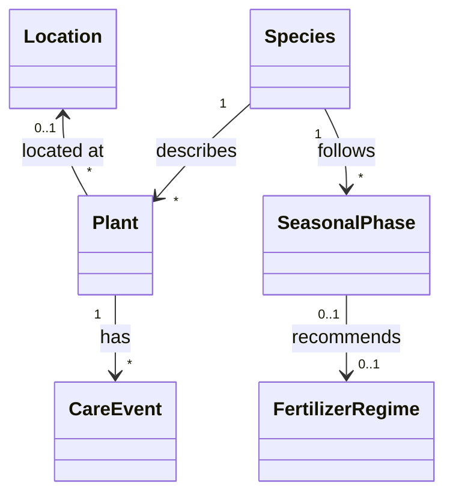

# Domain

## Core Concepts

### Species
Represents general knowledge about a plant species.

A species defines care preferences and seasonal behaviour shared by all individual plants of that species.

### Plant
Represents a concrete plant in the user's collection.

A plant references one species and may currently be assigned to a location.

### Location
Represents a physical place where plants are kept.

Examples include a balcony, living room window, propagation cabinet, or shelf.

### CareEvent
Represents something that happened to a plant.

Examples include watering, pruning, repotting, pest treatment, movement, or general observation.

Care events form the historical dataset of Plantly.

### SeasonalPhase
Represents a recurring period in the lifecycle of a species.

Examples include active growth, flowering, dormancy, or reduced growth.

### FertilizerRegime
Describes the recommended fertilisation approach during a seasonal phase.

## Relationships

